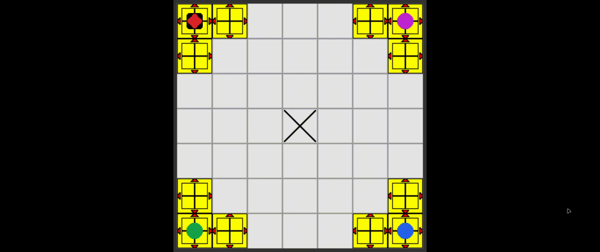

# rink-slider

This game is a personal achievement for me. When I decided to make this game I didn't know how to program.
But that didn't stop me from trying. You can see me asking for help on the Unity forums.

- [How to make a selectable platform](https://answers.unity.com/questions/633442/how-to-make-a-selectable-platform.html) | [Archived version](https://web.archive.org/web/20220626090630/https://answers.unity.com/questions/633442/how-to-make-a-selectable-platform.html)
- [Phi Brain game](https://forum.unity.com/threads/phi-brain-game.228427/) | [Archived version](https://web.archive.org/web/20231030130719/https://forum.unity.com/threads/phi-brain-game.228427/)

Noticed the date? *2014*. That's right. After **10 years(!)** I decided to "finish" this game. A lot has happened in those years, I got a job as a frontend developer and worked more than 6 years in that field. But I was never stuck in the confort zone, I always tried to learn different areas e stuff related to programming. After a layoff last year, I decided to focus more on what I always wanted to do. Making games. Because that was one of the reasons that I entered in this field.

I actually "finished" this game in 2022. I used Godot, but I didn't spent much time polishing and fixing bugs. The code was a mess and very complicated. Then I decided to rewrite in C++ using Raylib. I had some obstacles but in the end the code is more organized and the final product is way more polished.

The old version:

The new version:

